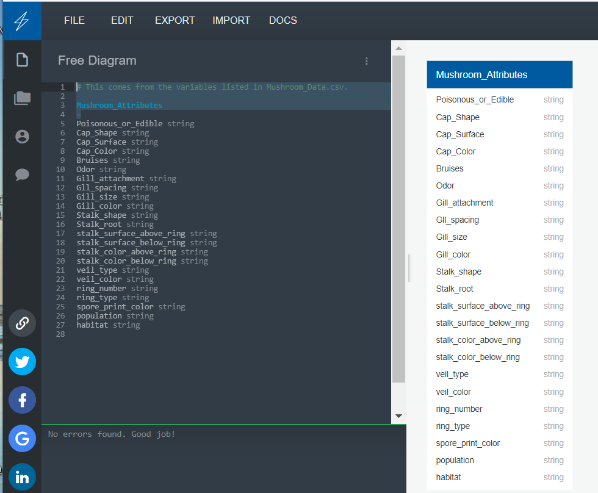

# Mushroom Analysis
## *Objective: Predict if a mushroom is edible or poisonous based on certain characteristics*

**Machine Learning Goal**: Create a model that will return a True/False value based on certain characteristics, i.e., mushroom in question is edible ("True") or poisonous ("False").

<<<<<<< HEAD
## Team Member Names 
=======
## Team Member Names and Roles 
>>>>>>> 34f7e40f16f8371e09fa43bd0148c25074f566d7
- Beth Berry 
    - Segment 1: Mockup Database/Research Datasets
    - Segment 2: Objective: Presentation/Google Slides
- Julia Harvey
    - Segment 1 Objective: Machine Learning Model Mockup//Research Datasets
    - Segment 2 Objective: Machine Learning Model in Python 
- Joshua Fait
    - Segment 1 Objective: Machine Learning Model Mockup/Research Datasets
    - Segment 2 Objective: Database creation and integration
- Drew Trefsgar
    - Segment 1 Objective: EDA/Research Datasets
    - egment 2 Objective: Machine Learning in Python/R
            - Back up: Review Presentation/Google Slides
- Alyssa Warnock 
    - Segment 1 Objective: EDA/Research Datasets
    - Segment 2 Objective: Machine Learing in Python/R 
            - Make the linear regression model in R or Python
            - Write up the machine learning aspect of it

## Segment 1 Deliverables
1. Decide on a topic for project: Mushroom Analysis
    - Select a question: Is the described mushroom edible or not, i.e. is it poisonous?
2. Find preliminary datasets for your project: [link_to_Resources/mushroom_df_clean.csv](Resources/mushroom_df_clean.csv)
3. Perform rudimentary EDA on the datasets that have been found: [link_to_ETL_.ipynb](https://github.com/awar2170/Team1_FinalProject/blob/main/ETL%20.ipynb)
4. Create a mockup of the database: (Beth) 
5. Create a mockup of the machine learning model you are going to use: (Joshua and Julia)
	- Testing both Tensorflow and RandomForest for best results
		- [link_to_ML](machineLearning.ipynb) (Tensorflow)
		- [link_to_RF](https://github.com/awar2170/Team1_FinalProject/blob/main/RandomForest%20Machine%20Learning%20.ipynb) (RandomForest)
6. Technologies Selected:
	- SQL database (https://www.heroku.com/postgres)
	- Python (VS Code / Juypter Notebook)
	- Website (https://pages.github.com/)

## Segment 2 Deliverables 
1. Presentation Draft     
    - Selected topic
    - Reason topic was selected
    - Description of the source of data
    - Questions the team hopes to answer with the data
    - Description of the data exploration phase of the project
    - Description of the analysis phase of the project

2. Machine Learning Model 
    - Description of preliminary data preprocessing
    - Description of preliminary feature engineering and preliminary feature selection, including the decision-making process
    - Description of how data was split into training and testing sets
    - Explanation of model choice, including limitations and benefits

3. Database Integration 
    - Database stores static data for use during the project
    - Database interfaces with the project in some format (e.g., scraping updates the database)
    - Includes at least two tables (or collections, if using MongoDB)
    - Includes at least one join using the database language (not including any joins in Pandas)
    - Includes at least one connection string (using SQLAlchemy or PyMongo)

4. Dashboard
    - Storyboard on a Google Slide(s)
    - Description of the tool(s) that will be used to create the final dashboard
    - Description of interactive element(s)
